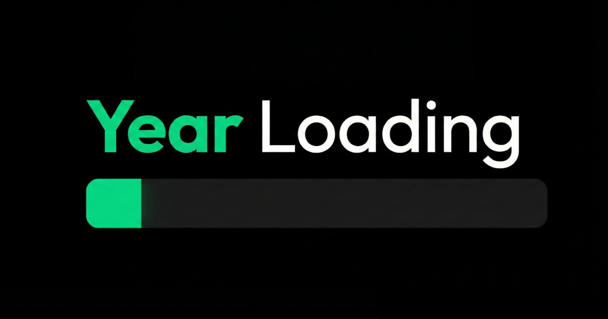

<div align="center">

  

  <br />

  <p>
    
    
    
  </p>

  <p>
    <b>A minimalistic web dashboard that tracks the progress of the current year in real-time.</b><br>
    <i>Precision tracking, bilingual support, and theme customization.</i>
  </p>

  <p>
    <a href="https://Marwan-Official.github.io/Year-Loading/">
      
      
    </a>
  </p>

</div>

---

## 📖 About The Project

**Year Loading** is a sleek web application designed to track the progress of the current year with mathematical precision. Built with a focus on aesthetics and performance, it offers a real-time perspective on time management.

It features a **responsive design** that adapts to any screen size and includes persistent settings for themes and languages, making it a perfect "New Tab" page or dashboard widget.

## ✨ Key Features

* **⚡ Real-Time Tracking:** Visual progress bar and percentage display that updates precisely every frame.
* **🎯 High Precision Mode:** Interactive click-to-reveal feature showing up to 8 decimal places.
* **🌍 Bilingual Support:** Instant toggle between **English (LTR)** and **Arabic (RTL)** layouts.
* **🎨 Dynamic Theming:** Built-in Dark Mode and Light Mode with local storage persistence.
* **⏰ Flexible Time Formats:** Toggle between 12-hour and 24-hour clock systems.
* **📱 Mobile Optimized:** Fully responsive UI built with Tailwind CSS.

## 🛠️ Installation

This project is built with **Vanilla JavaScript** and **Tailwind CSS (CDN)**, meaning no build steps or package managers (npm/yarn) are required to run it locally.

1.  **Clone the repository**
    ```bash
    git clone https://github.com/Marwan-Official/Year-Loading.git
    ```

2.  **Run the project**
    * Simply open the `index.html` file in your browser.
    * *Optional:* Use the "Live Server" extension in VS Code for the best experience.


## 📄 License

Distributed under the MIT License. See LICENSE for more information.
